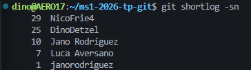
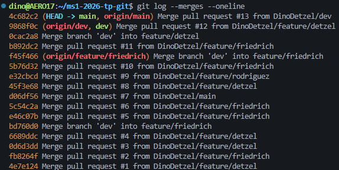
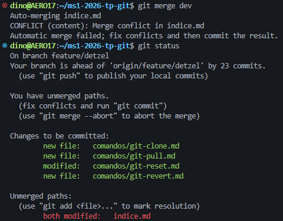

# Estadistica del repositorio.

## Integrante con mas commits.

Nico Friedrich: 29 commits.

Comando utilizado: `git shortlog -sn`

---

## Cantidad de merges.

16 merges.

Comando utilizado: `git log --merges --oneline`

---

## Cantidad de conflictos.

1 conflicto.

Conflicto previo a su resolucion. 

Lineas en la que hubo conflicto.

---

## Cantidad de ramas.

6 ramas.

## Commit con mas archivos modificados.

Hash: 6f5eeed

Comandos utilizados: `git log --numstat --oneline, git show --stat <hash>`

---

## Revert.

